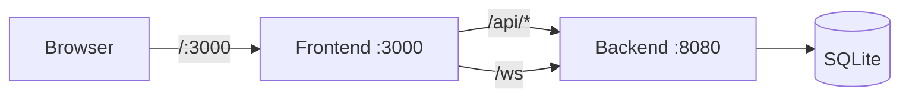

# 🌐 Real-Time Forum

Self-hosted real-time forum for private communities. Replaces proprietary group-chat tools with an open, auditable, single-binary SPA — zero tracking, full data ownership.

[](https://golang.org)
[](https://developer.mozilla.org/en-US/docs/Web/JavaScript)
[](https://bun.sh)
[](https://biomejs.dev)
[](https://github.com/ertval/real-time-forum/actions)

A powerhouse, production-grade **Real-Time Single-Page Application (SPA)**. Built with a high-performance Go backend and a cutting-edge Vanilla JavaScript (ES2026+) frontend. Experience seamless navigation, lightning-fast interactions, and live private messaging—all delivered through a single HTML document.

---

## 🚦 Project Status

The project is currently in **Active Development (Wave 3)**.

- **Foundations (Wave 1)**: ✅ Complete
- **Auth & Core Forum (Wave 2)**: ✅ Complete
- **Real-Time Chat (Wave 3)**: 🏗️ In Progress (Proxy ready, Backend started)
- **Bonus Features**: ✅ User Profiles (A07) implemented ahead of schedule.

Check the [Ticket Tracker](docs/ticket-tracker.md) for detailed progress.

---

## ✨ Key Features

### 🔐 Secure Authentication
- **Universal Login**: Access via **Nickname** or **Email** with a secure password.
- **Extended Profiles**: Rich registration capturing age, gender, and full name.
- **Session Integrity**: Hardened `HttpOnly` session cookies—no fragile JWTs.
- **Global Auth Shell**: Persistent login/logout controls reachable from every corner of the app.
- **Zero Guest Access**: A private, authenticated-only community experience.

### 📜 Dynamic Content
- **Fluid Feed**: Paginated post exploration with category tagging and rich media.
- **Deep Conversations**: Detail-focused comment threads load on-demand, keeping the feed lean.
- **Draft Mastery**: Save your thoughts and polish your posts before they go live.
- **Rich Media**: Dedicated image upload support for both posts and comments.

### 💬 Real-Time Private Messaging
- **Dynamic Roster**: A persistent chat sidebar with live presence indicators.
- **Intelligent Sorting**: Users are ordered by latest activity or alphabetically for new connections.
- **Elastic History**: Infinite-scroll chat history loading (10-message batches) with smart throttling.
- **Live Delivery**: Instant message arrival via WebSockets—no refresh, no delay.
- **Bonus Capabilities**: Send images in DMs and view full user profiles.

---

## 🛠️ Technical Excellence

### Backend Stack
- **Engine**: Go 1.24+ (Standard Library focus)
- **Database**: SQLite (ACID compliant persistence)
- **Real-Time**: `gorilla/websocket` for low-latency events
- **Security**: `bcrypt` hashing & `google/uuid` session tracking
- **Concurrency**: Advanced Goroutine/Channel patterns for maximum throughput

### Frontend Stack
- **Logic**: Vanilla JS (ES2026+) — zero frameworks (React/Vue/Angular)
- **Tooling**: **Bun** for speed, **Biome** for precision, **Vitest** for testing
- **Design**: Modern Clean Vertical Slices / Screaming Architecture
- **Performance**: Promise-based async operations and Proxy-driven state

---

## 🏗️ Architecture



- `cmd/`: Server entry points (Backend: 8080, Frontend: 3000)
- `SPA/`: **The Frontend Core** — Vertical slices for Auth, Feed, Post, Activity, Profile, Shell, Chat
- `internal/`: Business logic, persistence, and request handlers
- `web/`: Historical assets, static uploads, and startup guards
- `data/`: Persistent SQLite storage
- `docs/`: System Design (SDS), Product Requirements (PRD), and Audit trails

> [!NOTE]
> The project utilizes a **Split-Server Topology**. The Frontend server (`:3000`) serves the SPA shell and proxies all `/api/` and `/ws` traffic to the Backend server (`:8080`).

---

## 🚀 Quick Start

### 📋 Prerequisites
- **Go 1.24+**
- **Bun** (Runtime & Package Manager)
- **Make**
- **SQLite**

### ⚡ Run the Stack
```bash
# 1. Install all dependencies
make deps

# 2. Launch both servers (Backend & Frontend)
make run

# 3. Verify Infrastructure (Sanity Checks)
make verify-infra
```
🔗 **Access the Forum**: [http://localhost:3000](http://localhost:3000)

### 🧪 Quality Control
```bash
make test          # Run the full suite (Go + Vitest + Playwright)
make test-e2e      # Run only Playwright E2E tests
make lint          # Execute Biome static analysis
make format        # Standardize code formatting (Backend + Frontend)
make format-frontend # Fix Biome static analysis issues
```

**Run E2E through `make`, not Playwright directly.** `make test` / `make test-e2e`
are the supported local entry points: they free ports `3000` (frontend) and `8080`
(backend) and start a fresh server. The Playwright config sets `reuseExistingServer:
false`, so invoking `bun x playwright test` by hand while a dev server is already
running fails with a port-in-use error instead of silently reusing the existing
(possibly stale) instance. Stop your dev servers — or just use `make test-e2e`,
which handles cleanup for you.

### 🧪 Testing Tiers

The project follows a rigorous three-tier validation strategy:

| Tier | Purpose | Tools |
|:--- |:--- |:--- |
| **Unit** | Isolated component & helper logic | Vitest (JSDOM/Node) |
| **Integration** | Feature interactions & API contracts | Go `httptest` + Vitest |
| **E2E** | Full multi-step user journeys | Playwright (Headless Chrome) |

**Note**: Playwright browsers are automatically installed during `make deps`. If you encounter issues, run `bun x playwright install chromium`.

### 🌱 Database Seeding
Use the QA seed runner when you want a deterministic local dataset.

```bash
make seed-qa
```

By default this seeds:

```bash
./data/forum.db
```

You can also target a different SQLite file:

```bash
go run ./cmd/qa-seed --db-path /tmp/forum-seed-check.db
```

Important notes:
- The seed runner resets QA-owned tables and recreates the same users, posts, comments, reactions, and notifications each time.
- Bootstrap categories are not treated as QA sample data and are preserved separately.
- Do not reseed a database that is actively being used by a running backend process.
 

### 🧪 Test Credentials
For quick testing and QA, the following user is available in the default seed data:

| Role | Nickname / Email | Password |
|:--- |:--- |:--- |
| **Test User** | `tester` / `tester@example.com` | `password` |

---

## 📂 Documentation

Deep dive into the project's blueprints:

- 📖 **[docs/requirements.md](docs/requirements.md)**: The basic requirements document, source of truth for what the project should do.
- 📐 **[docs/SDS.md](docs/SDS.md)**: Detailed technical specifications.
- 📋 **[docs/audit.md](docs/audit.md)**: Success criteria and verification gate source of truth.
- 🤖 **[AGENTS.md](AGENTS.md)**: Essential guide for AI coding assistants.
- 🏗️ **[architecture.md](architecture.md)**: High-level structural overview.

---

## 🛰️ API at a Glance

| Method | Endpoint | Description |
|:--- |:--- |:--- |
| `POST` | `/api/v1/users/login` | Authenticate and start session |
| `POST` | `/api/v1/users/register` | Create account with profile data |
| `GET` | `/api/v1/users/me` | Bootstrap session verification |
| `GET` | `/api/v1/posts` | Fetch the paginated global feed |
| `GET` | `/api/v1/chats` | Retrieve roster with presence state |
| `GET` | `/ws` | WebSocket for live chat & events |

---

## Related
- [CV / Portfolio](https://ertval.github.io)
- [forum](https://github.com/ertval/forum) — Hexagonal Go monolith

---

<div align="center">
  <sub>Built with ❤️ by the Real-Time Forum Team. Licensed under GPL-3.0.</sub>
</div>
